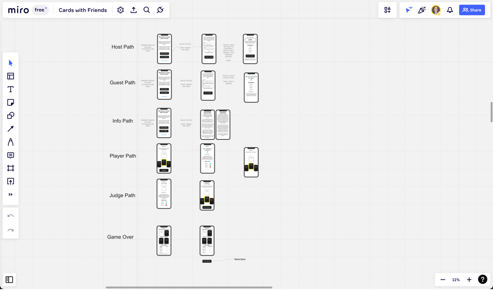
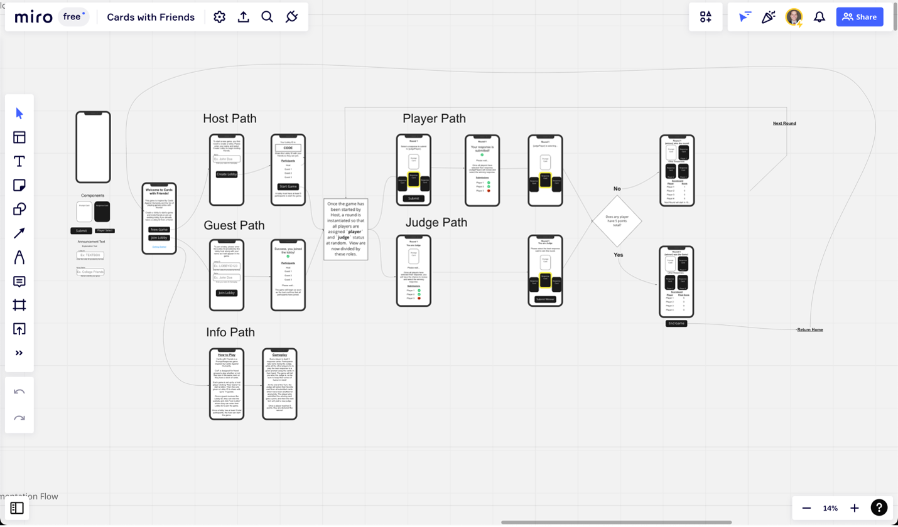
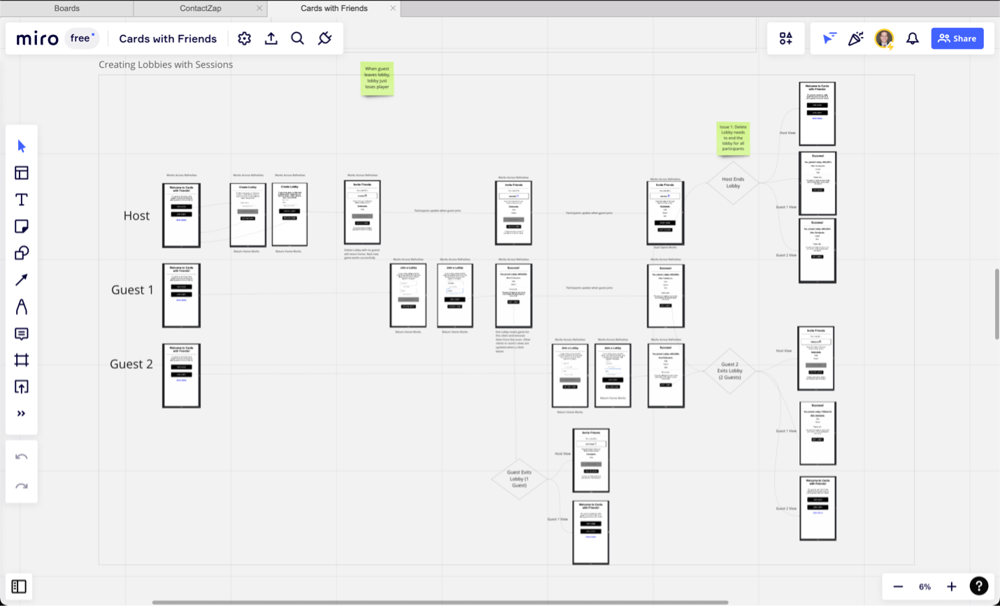
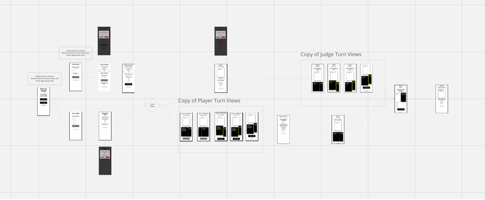

# Version 2: Multi-Device MVP

## Tools Used:
- Canva
- Miro
- Draw.io
- React
- Material UI
- GoDaddy
- AWS S3 Bucket
- **TypeScript**
- **Node.js**
- **Express**
- **Socket.io**
- **EC2**
- **PM2**
- **Async/Await**


## Product Vision & Goals
The vision of the product at Version 2 to enable gameplay across multiple devices allowing for both in-person and fully remote gameplay. From talking to users about the game, it seemed that being able to experience the reactions of other players was very important, so I decided to continue to optimize the experience with the use-cases of in-person and video call in mind.

The goal for V2 was to figure out what elements were necessary for online play.  In addition to the multi-client technical challenge, I also wanted to ensure the User Experience was clear and easy to follow and the UI was clean and reactive.

## Identifying Problems
Enabling online play was the premier technical challenge which had a number of ripple-effects. The shift from a self-contained game engine in the browser to enabling state updates across multiple clients entailed:

- Re-Mapping the the application flow.
- Creating new views to represent the new flow and user classes.
- Tracking and identifying each client within and across connections.
- Allowing users a way to organize and connect in an online game.
- Tracking Game State for each client and updating across all clients in the same game.
- Updating the Data Structures/Algorithms.
- Creating a more complete Gameplay Experience to keep track of Round and Game Winners.
- Improving the UX and UI along the way to be more responsive and clean.

Finally, some of my content was unsavory, so I also wanted an option for more "safe-for-work" content.

## Understanding the Problems
Before diving into technical challenges right away, I wanted to take some time to think about the User Experience. Cards Against Humanity needs a minimum of 3 players, and to play online they will need to be able to be linked together. So before getting to the Gameplay phase of the game, there would have to be a Game Creation phase where users find their friends online. Once they were linked, they could then be moved into Gameplay. With this in mind, I divided the application into two distinct phases: Creating Game & Gameplay.

Thinking more deeply into user stories in each phase, I imagined a user logging onto the site. The user would need to do one of three things: Create a game, Join a game, or learn about the app. Once gameplay was started, I already knew from V1 that there were Players and Judge users, and that categories would change, where a host will become a player and then judge. So across the app, I decided to put users in one of these 5 categories based on where the were in the flow and what they wanted/needed to do: Host, Guest, Info, Player, & Judge. 

Now with some high-level understanding, it was time to start breaking down the logical steps of the application into pseudo-code for each of the two phases and five categories of user:

### Creating Game: Host, Guest, & Info Paths
- User visits Home Page as one of the following:
  - Host Path: User looking to Start a Game
    - Host enters name and selects card deck
    - Lobby is created
    - Host invites friends to join the lobby
    - When friends arrive, user may start gameplay 
  - Guest Path: User looking to Join a Game
    - Guest enters name and finds and joins their desired host's lobby
    - Guest enters gameplay when host starts game
  - Info Path: User wants to Learn about the Game
    - User reads info and returns home

### Gameplay: Player & Judge Paths 
- Game Begins 
  - Round Started
    - Cards are dealt to all game participants & Prompt Card is drawn.
    - One participant is designated as judge.
    - All non-judge players will select a Response Card from their hand.
      - If all players have not selected, the player will be waiting.
      - The Judge Will be waiting.
    - Judge Player will select the Winner
      - Non-judge players will be waiting
    - Round or Game Winner is declared
      - Player's score is incremented
      - Winning Cards and Players are displayed
      - Option to play new round/game offered
- Loop

### Additional Considerations
For a plesant gameplay experience, the app will need to handle additional functionality:

- User refreshes connection or leaves site should not abandon game or lose state/view data.
- Numer of players should be dynamic.
- Game State needs to centralized and updated instantly across clients.
- A user should be able to leave the lobby or end a game.

Now with some pseudo-code and requirements, I could start putting together visuals to represent the states and actions.

## Mapping out the Experience
I took to Miro to get put together some logical flows and get some idea of how the user's experience should be mapped in a way that makes clear how to use the app and makes gameplay intuitive at any point in the experience.  

### Basic User Flow
I first mocked up a start-to-finish journey for users at each step in their journey based on the 5 categories of User separately (Note: Game Over/Results was part of Player & Judge paths).




With the increased number of types of users spread across multiple clients, it was also important to inform the user what is happening at each step of the journey (i.e. “who is the judge?”, “who is winning?”, “what do I need to do now?”, etc.). I made sure to use Headings and Call-to-Actions to inform the user of where they were in the journey and included waiting screens to inform and reassure users of what is happening in the game while they are waiting for other players.

Feeling confident about each user Journey, I then expanded my original V1 Mock-Up in incorporate the two phases of play and the 5 user journeys:



### Advanced Flow Elements
In addition to the basic flow, I also knew that there were some additional complexity to handle in regards to giving users access to leave a lobby or game and determining how to handle these cases. I decided that 

## Engineering the Solution
Now with a good idea of the basic flow of the app and some pseudo-code, it was time to think about implementation

### Scalability: TypeScript Migration
Since I was going to be moving things around a lot and increasing the size and complexity, I decided to migrate my codebase to TypeScript to leverage type-safety and linting.  It made sense to make this migration first before adding additional features. To do this, I simply installed TypeScript and types for the libraries I was using and began migrating files one-by-one from `js`/`jsx` to `ts`/`tsx`.  This gave me ample exposure and experience to the benefits of type-safety and the syntax of TypeScript on existing code before trying to build new files/components with the new syntax.

### Back-End Requirements
With a networked game, I knew I would need a server, but I needed to think a bit about what I needed my server to do.  I alredy had my Front-End being distributed by an S3 bucket, so I didn't need to serve Front-End data. I made a list of requirements for my back-end.

#### Things my Back-End needed to do
- Establish a connection with each client
- Uniquely identify each client on each future request
- Store data about each client (current view, game joined, name)
- Store data for each Game (players, game state)
- Associate Clients in the same lobby/game
- Handle the logic for running the game engine and updating state
- Receive and Push updates to all players in real-time
- Remove Client from Game/Lobby and handle the effect on the game and other players in game

I also thought things my back-end would not need to do, as adding constraints would help to narrow my focus toward only what is necessary.

#### Things my Back-End did not need to do
- User Authentication: Users just want to play a game as quickly as possible.
- Store long-term persistent data: In-memory storage would do the trick until user-count ramped up. Using JS Objects, I could easily adopt a document database (like MongoDB) or caching (Redis) later.

### Technology Selection
I started doing research to find out what solutions already existed for the various problem spaces in my server requirements. 

#### Backend Language: Node.js
- I already knew I planned to use Node.js on the server, as I already had familiarity with Node/JavaScript/TypeScript.
- This helped me narrow my future tool choices to one ecosystem.
#### Backend Framework: Express
- I found that I could manage much of the Server options easily with Express (CORS, routing, etc.). 
- Express offered a more robust HTTP server with many options for easy integration with other tools in the ecosystem.
#### Updating Clients: Socket.io
- Socket.io worked with Node & Express to enable bi-directional websocket communication between all clients and server out of the box.
- Socket.io would allow me to define custom events client-side & server-side to ensure all the server and all clients were in-sync.
- Updating multiple users would become seamless using Pub/Sub events architecture rather than making new HTTP requests every time.
- I could use the Lobby ID from the mock-ups on the front-end as the unique room on the back end to link and update clients.

#### Session Management: Custom Solution
- Socket.io created Unique ID's which would track clients, but they reset across refreshes and re-connections.
- I needed to create a persistent Session ID to link with the Socket ID on the back-end to avoid resetting the client on these re-connections.
- I decided to implement my own SessionStore that would track a consistent Session ID stored on the user's browser and communicated to the server on every connection request.
- This would allow a user's session to be created on first connection and restored on reconnection.
- This also added some additional complexity, which I will cover in my Additional Mock-Ups section.

#### Game Engine: Custom Solution
- Since multiple games can be played now at once, I needed a GameStore data structure to store all active games and associate them with the appropriate clients. 
- I decided to keep in-memory both to avoid additional Database complexity and because I only needed semi-persistence (memory to last through the game, but not necessarily after a game is finished). 
- The tradeoff for this decision, clearly, is scalability and reliability.

#### Hosting/Deployment
-	I selected AWS EC2 as my back-end hosting platform.  I had familarity with AWS and knew this would be affordable.
- An architecture to help me shift between Dev, Test, and Prod environments
  - `CONTRIBUTING.md` created to store all info on how to develop, test, and deploy for the app.
  - Dev: 
    - `concurrently` in dev to run both react and node server at the same time.
    - `.env` file to house environment variables and sensitive data.
  - Test/Prod: 
    - Setting up a server for both Test and Prod with environment variables for Test or Prod, respectively.
    - Creating React build script to set front-end environment variable to test or prod, respectively.
    - Using `PM2` to run production server and store logs.
    - Elastic IP: used to keep a consistent URL for the EC2 instance across time and server re-boots.

### Data Structures/Algorithms
I sized up my data needs as Users and Games. I decided to separate these two because:

1. Users had data needs regardless of whether they were actively part of a game
2. Multiple Users will be part of one game

I knew I wanted to use a JS Array to keep up with the arbitrary number of Sessions and Games that could be active at any time and reference them by ID's. Within the Arrays, I would store objects that represented Session data and Game data respectively.  I would essentially have Foreign keys in Session to reference an active game and in each game to reference the Sessions associated with the game.

A rough layout of my data stores are below:

```typescript
  // Object that stores all Games in an arrya and houses Methods for Search and CRUD Operations
  class GameStore {
    games: Game[];

    constructor() {
      // All Games array
      this.games = [];
    }

    // Methods..
    addGame(game: Game): void {
      this.games.push(game);
    }
  }

  // Same with Session Store
  class SessionStore {
    sessions: Session[];

    constructor() {
      // Store the array of all Game objects on the GameStore Object
      this.sessions = [];
    }
    
    // All methods used to perform CRUD or Seach operaions on the store
    createSession(socketId: string, lobbyId: string | null, view: string): Session {
      const session = new Session(socketId, lobbyId, view);
      this.sessions.push(session);
      return session;
    }

    // ...more methods
  }
```

The structure of the data (in TS Types):

```typescript
  export type SessionDataType = {
    sessionId: string;
    socketId: string;
    lobbyId: string | null;
    view: string;
  }

  export type GameDataType = {
    id: string;
    NSFW: boolean;
    round: RoundDataType | null;
    previousRounds: RoundDataType[];
    players: PlayerDataType[];
    judgeIndex: number;
    promptCards: CardDataType[];
    responseCards: CardDataType[];
    cardsPerPlayer: number;
    pointsToWin: number;
    winner: PlayerDataType;
  };

  export type RoundDataType = {
    number: number;
    players: PlayerDataType[];
    judge: PlayerDataType | null;
    promptCard: CardDataType;
    winner: PlayerDataType | null;
  }

  export type PlayerDataType = {
    sessionId: string;
    name: string;
    cards: CardDataType[];
    selectedCard: CardDataType | null;
    wins: number;
    readyForNextRound: Boolean;
  }

  export type CardDataType = {
    id: number;
    text: string;
    type: string;
    NSFW: boolean;
  };
```

### Additional Mock-Ups for Session & Game Management
As I got into the application development, I realized that I needed to not only keep user sessions across reconnections, but also allow users to leave a game and end a session if they desired, otherwise they would be stuck.  I decided to create some additional mock-ups to handle the situations where a user decided to leave a lobby. 





If a host left the lobby or a player left an active game, I decided to terminate the game/lobby entirely. Otherwise, if a guest leaves a lobby, I would simply remove them from the lobby. For any user who left a game/lobby, their session was reset and their view set back to home.  Additionally, I wanted to ensure that the option to leave was present on all screens, but not super-prominent. Finally, to avoid accidentally ending games, I added a confirmation dialogue screen before ending or exiting a game.

## Finished State
After much trial and error and many small sprints, I was able to finally arrive at a new version of the game!

### Create Game Phase
<!--  -->

### Gameplay Phase
<!--  -->

